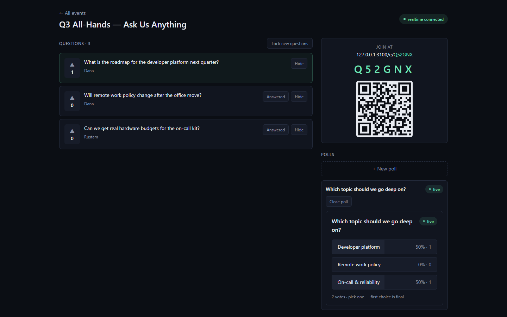
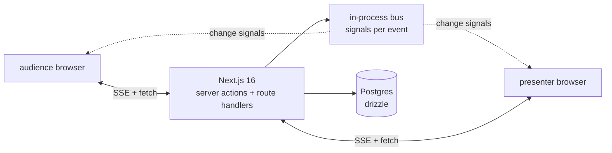
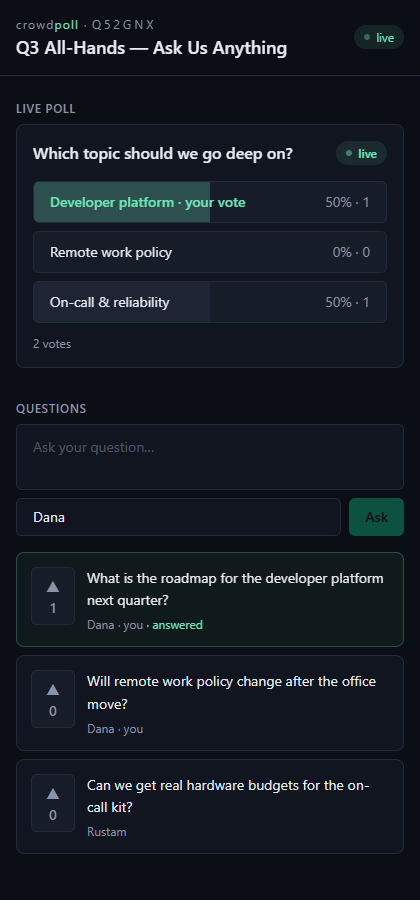

# crowdpoll

[](https://github.com/aminyx/crowdpoll/actions/workflows/ci.yml)
[](package.json)
[](LICENSE)

Live audience Q&A and polls for talks, streams and meetings. The room joins with a six-letter code — no accounts, no app — asks questions, upvotes the ones that matter, and votes in polls whose bars move in real time on every screen.



## How it works

Two roles, two surfaces:

- **Presenter** signs in, creates an event, and gets a control room: live question feed with moderation (answered / hide / restore), a lock for new questions, poll builder with draft → open → closed lifecycle (one live poll at a time), and a join card with the code and QR.
- **Audience** opens `/e/CODE` — identity is an anonymous httpOnly session cookie, no signup. They ask (optionally named), upvote, and vote in the live poll. First poll choice is final.

Everything updates live in both directions over **Server-Sent Events**: mutations broadcast a signal on an in-process bus, subscribed clients refetch state. The database stays the single source of truth — the realtime layer carries invalidation signals, not data, so a missed message can never show stale-forever state (any refetch heals).



<p align="center">
  
</p>

## Engineering notes

- **Vote integrity by constraint, not hope**: one upvote per question and one poll vote per person are primary keys (`question_id + session_id`, `poll_id + session_id`). Races and double-clicks hit `ON CONFLICT DO NOTHING`, not duplicate rows.
- **Anonymous ≠ unprotected**: every audience write is validated with zod and rate-limited per session (token bucket, unit-tested). The README-level honesty: cookie-based identity is best-effort dedup — clearing cookies grants a new vote, which is the standard trade-off for frictionless joining, and it is documented instead of hidden.
- **Auth is the current standard, not a hand-rolled session**: better-auth with the Drizzle adapter, email+password for presenters only.
- **Next 16 idioms**: Server Components for initial state, Server Actions for all mutations, route handlers for SSE/state/auth, async `params`/`cookies`, Turbopack builds. Cookies are minted only where Next allows it (route handlers / actions) — the pages read them.
- **One live poll at a time** is enforced server-side: opening a poll closes the previous one in the same statement batch.

## Getting started

```bash
git clone https://github.com/aminyx/crowdpoll
cd crowdpoll
docker compose up --build     # app on :3000, Postgres with schema pre-applied
```

Local development:

```bash
docker run -d --name crowdpoll-pg -p 5435:5432 \
  -e POSTGRES_USER=crowdpoll -e POSTGRES_PASSWORD=crowdpoll -e POSTGRES_DB=crowdpoll \
  postgres:17-alpine
cp .env.example .env          # set BETTER_AUTH_SECRET
npm install
npx drizzle-kit push          # apply schema
npm run dev
```

Open two browser windows — one presenter, one incognito audience — and watch votes move both screens.

## Environment variables

| Variable | Required | Description |
|---|---|---|
| `DATABASE_URL` | yes | Postgres connection string |
| `BETTER_AUTH_SECRET` | yes | Session signing secret (long random string) |
| `BETTER_AUTH_URL` | in production | Public base URL for auth callbacks |

## Testing

```bash
npm test          # vitest: rate limiter, join codes, event bus
npm run lint
npm run typecheck
```

The realtime flow is additionally exercised end-to-end in development with a scripted two-audience walkthrough (sign-up → questions → upvotes → live poll from two independent anonymous sessions); the screenshots above are its real output.

## Limitations & trade-offs

- The SSE bus and rate limiter are in-process: one app instance. Scaling out means swapping both for Redis pub/sub — the interfaces are two functions each, by design. For its purpose (rooms of hundreds, one instance) this is the right simplicity.
- Anonymous vote dedup is per-cookie, not per-human (see above).
- No WebSockets: SSE is one-way, which fits this data flow (writes go through actions anyway) and survives proxies/serverless better.
- Vercel deployment works but SSE connections recycle on function timeouts; the client auto-reconnects and refetches, so the demo degrades to eventual refresh rather than breaking.

## Future improvements

- Redis-backed bus + rate limits for multi-instance
- Word-cloud and rating poll types
- Presenter "project mode" — full-screen results view for the venue screen
- Export of questions and results (CSV)

## License

[MIT](LICENSE)
